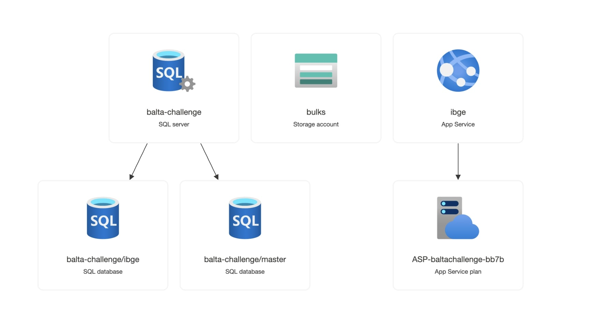

# Introduction

The challenge will be based on the [repository](https://github.com/andrebaltieri/ibge/tree/main) that contains data about cities and states throughout Brazil.

The instructions for the challenge can be found [at this link](https://baltaio.blob.core.windows.net/temp/desafio-dotnet/01-sobre.pdf).

PS: The resource will be active until end of October 2023.

# Video Demo

https://www.youtube.com/watch?v=e7q3wSfYPEs

# Docs

https://ibge.azurewebsites.net/swagger/index.html

# Resources



# Requirements

- .NET 7
- Docker (optional)

# How to use

## Using without Docker

### restore

```bash
dotnet run restore
```

### build

```bash
dotnet run build
```


## Create a database

```sql
CREATE DATABASE ibge;
```

# run

```bash
dotnet run --project Ibge
```

# SwaggerUI

https://localhost:7186/swagger/index.html


# References

This following links are the references i read for build this project:

https://learn.microsoft.com/en-us/dotnet/core/testing/unit-testing-with-mstest

https://learn.microsoft.com/en-us/dotnet/core/testing/unit-testing-best-practices

https://stackoverflow.com/questions/51489111/how-to-unit-test-with-actionresultt

https://learn.microsoft.com/en-us/aspnet/core/web-api/action-return-types?view=aspnetcore-7.0&viewFallbackFrom=aspnetcore-2.2#actionresultt-type

https://learn.microsoft.com/en-us/previous-versions/aspnet/cc668224(v=vs.100)

https://www.youtube.com/watch?v=kgzc_gw2pi8

https://learn.microsoft.com/en-us/dotnet/standard/serialization/system-text-json/ignore-properties?pivots=dotnet-7-0

https://www.infoworld.com/article/3669188/how-to-implement-jwt-authentication-in-aspnet-core-6.html

https://learn.microsoft.com/en-us/aspnet/core/fundamentals/dependency-injection?view=aspnetcore-5.0
